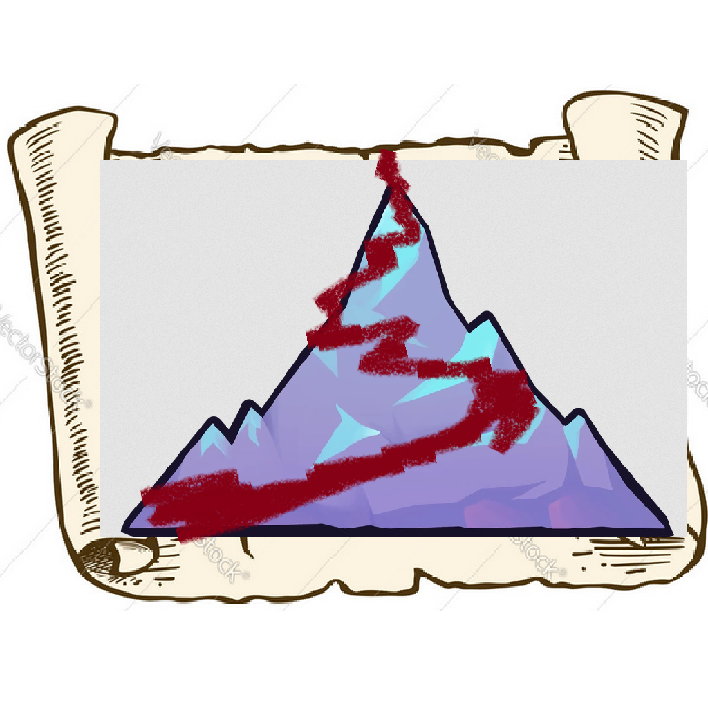

# Atlas

Record and render paths for celeste TASes
(new logo in the works)

 

## Usage

### Prerequisites

- Download @viddie's Consistency Tracker Mod ([Olympus 1-Click Install](everest:https://gamebanana.com/mmdl/1146408,Mod,358978"))
    - increase the max recordings count (default is 10)

### App

## Results

### Prologue

## Mausoleum TAS contest comparison

## FAQ

**Q**: An entity is missing from the map png

**A**: Open an [issue](https://github.com/jakobhellermann/Atlas/issues/new) and I'll try to fix it