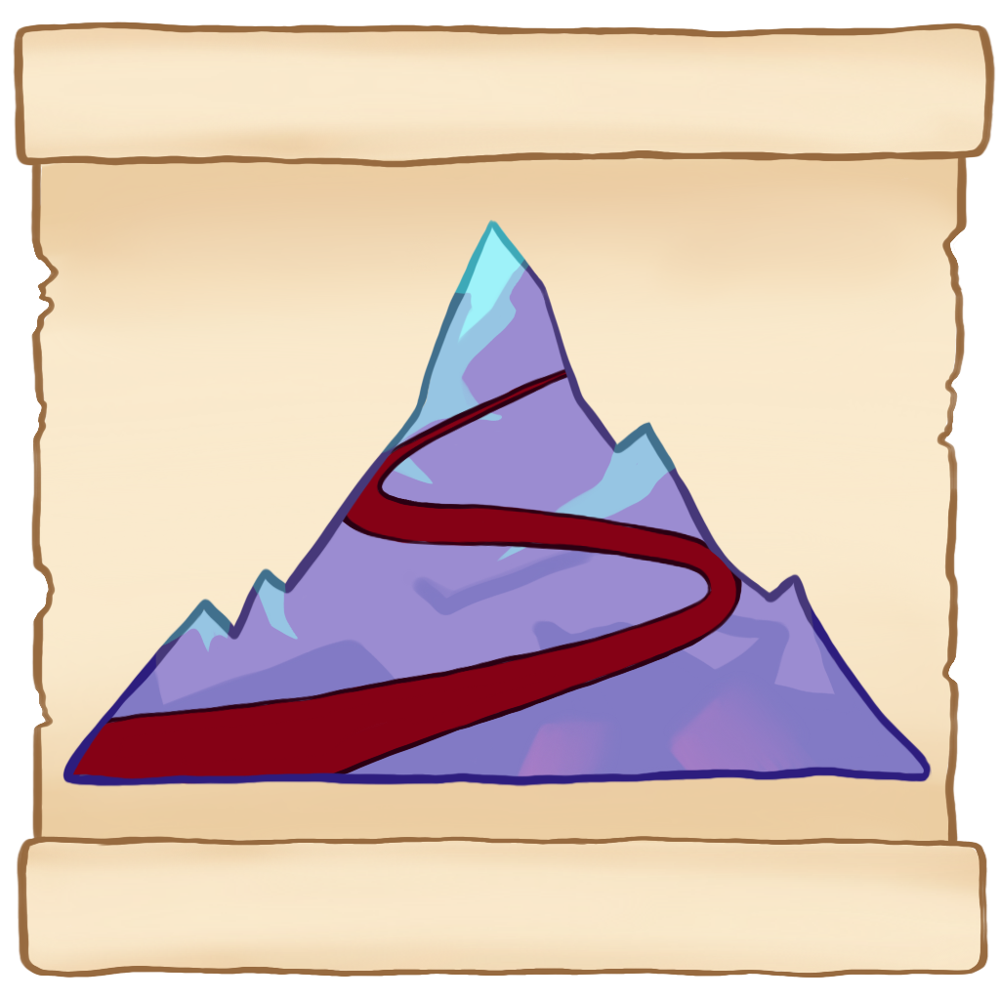

<h3 align="center">
Atlas
</h3>

Path recorder and renderer for Celeste TASes.

## Usage

### Prerequisites

- Download @viddie's Consistency Tracker Mod ([Gamebanana](https://gamebanana.com/mods/358978))
    - increase the max recordings count (default is 10)

### App

## Results

### Prologue

## Mausoleum TAS contest comparison

## FAQ

**Q**: An entity is missing from the map png

**A**: Open an [issue](https://github.com/jakobhellermann/Atlas/issues/new) and I'll try to fix it